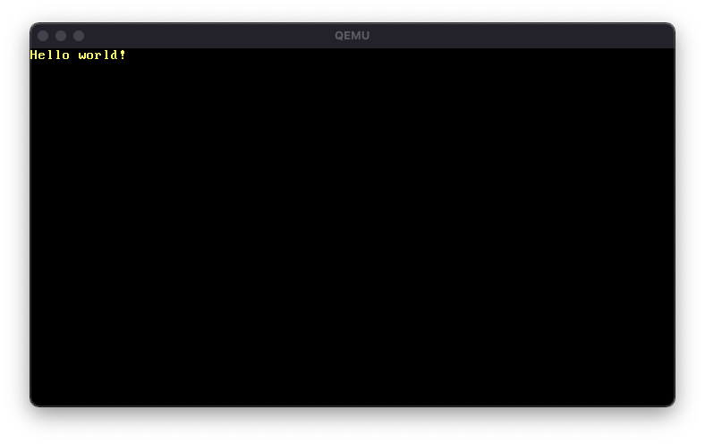

# OS
Walkthrough of the series `Write Your Own 64-bit Operating System Kernel From Scratch` credit to [CodePulse](https://www.youtube.com/channel/UCUVahoidFA7F3Asfvamrm7w)

+ OS implements paging to allow for 64 bit operation
+ Uses written C functions to print to display 
+ Uses colour values to set colour output
+ Kernel runs 3 C commands: clear screen, set colour, print `Hello world!`